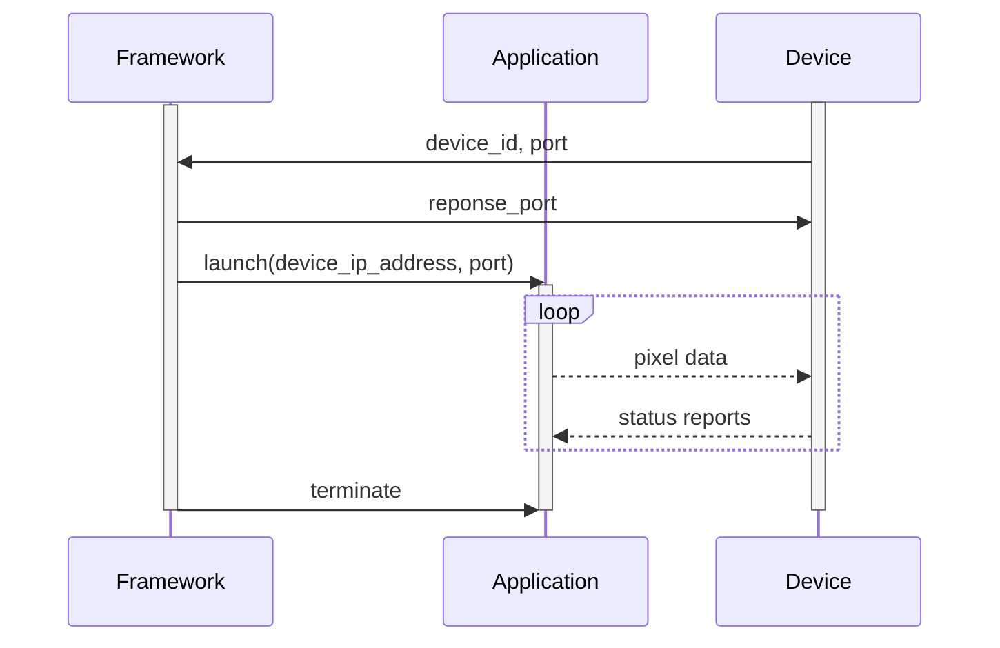

Audioviz
========

This project is a prototype and sandbox to play around with audio visualization on NeoPixels.

Requirements on Ubuntu 20 LTS on RaspberyPI 4:

- libasound2-dev
- python3-dev
- gcc
- gfortran
- libopenblas-dev
- liblapack-dev
- cython3
- python3-pip
- poetry
- pybind11 (from pip)

Pillow needs
zlib1g-dev libjpeg-dev

These are needed because you will need to build numpy and scipy. 

If you wish to run the monitoring tool on a development machine you will need:
- libxcb-xinerama0

# Protocol

